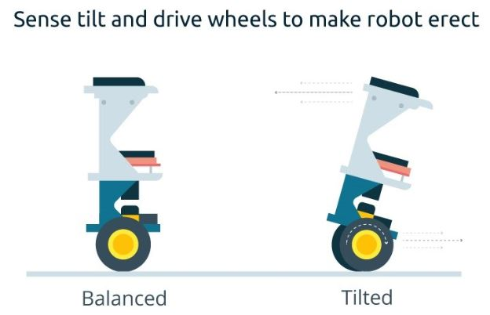
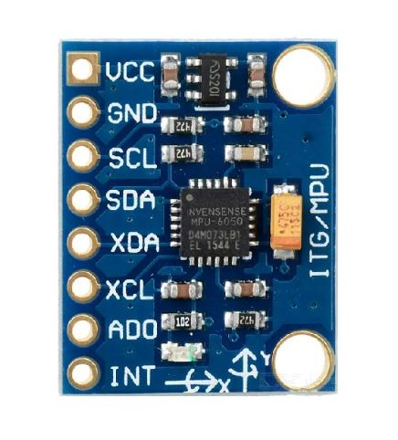
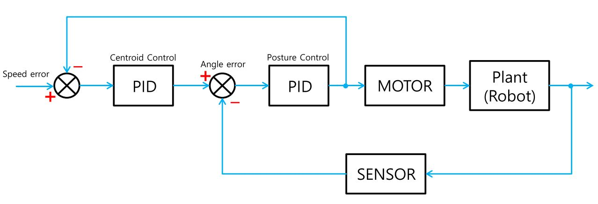
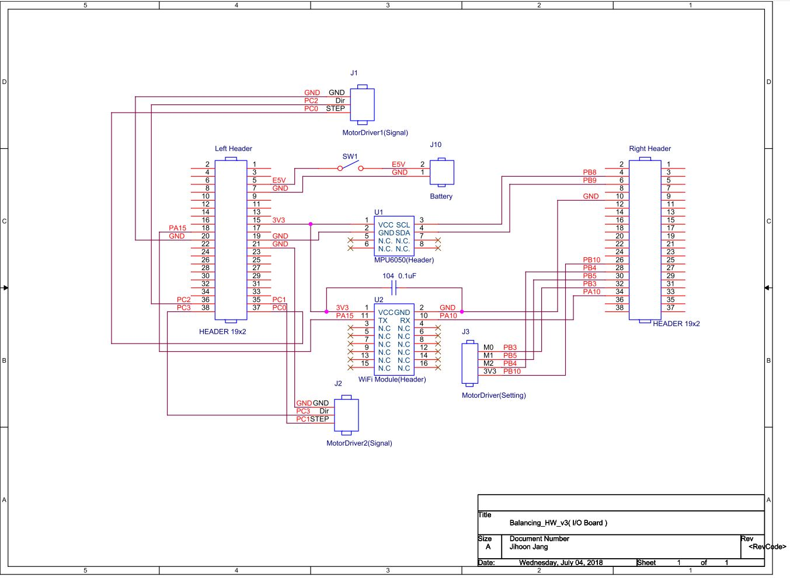
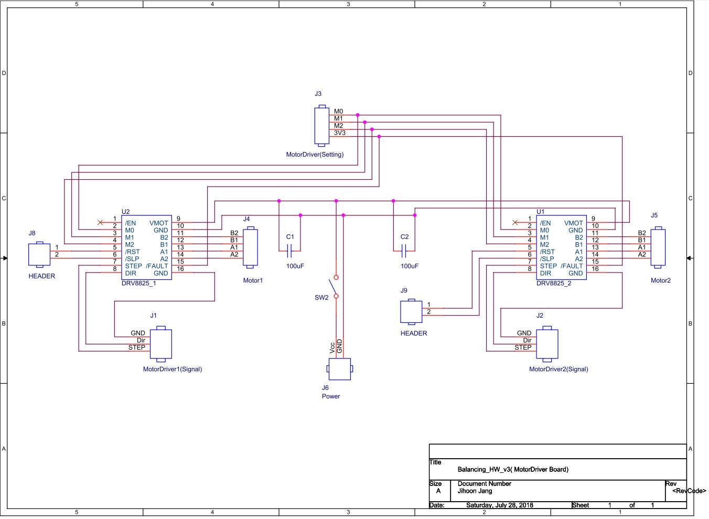
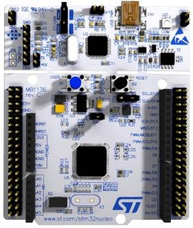
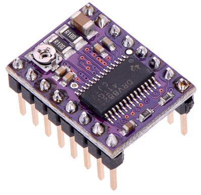
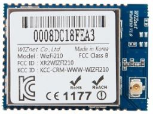
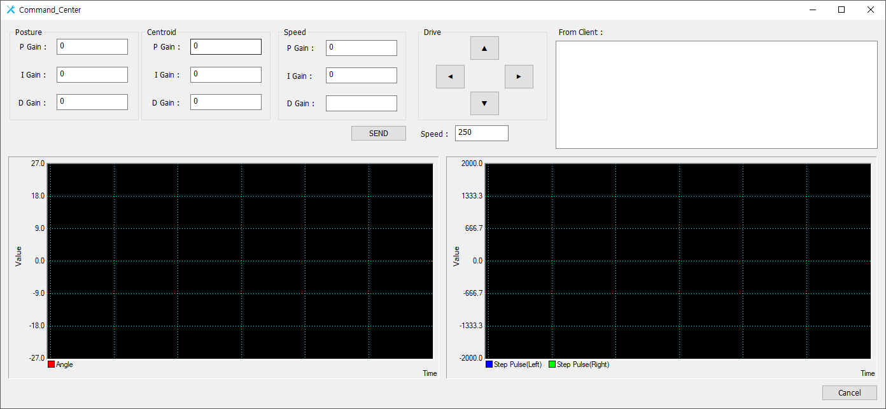

# Overview  

도립 진자 형태의 모바일 로봇을 제어하는 프로젝트입니다  

## Inverted Pendulum mechanism  

  

* 로봇이 기울면 모터를 움직여서 중심을 잡는다
* 이것을 위해서 로봇이 기울어진 각도를 알 수 있는 센서 필요

### IMU Sensor  

* IMU(관성측정장비) : 가속도계, 회전 속도계, 자력계 등  

  

* MPU6050
    * 회전 속도계, 가속도계가 결합된 형태의 센서 모듈
    * I2C 통신 인터페이스 포함

## Control  

### PID Control  

* 비례-적분-미분 제어기
    * 비례항 : 현재 상태에서의 오차값 크기에 비례한 제어작용
    * 적분항 : 오차값 크기를 적분하여 제어작용, 정상상태 오차를 줄이는 역할
    * 미분항 : 출력값의 급격한 변화를 줄여 오버슈트를 줄이고 안정성 향상

### Block Diagram  

  

# Balancing Robot (Stepper-Motor)  

로봇을 제어하는 하드웨어와 소프트웨어입니다  

## Hardware  

### Circuit

#### I/O Board Circuit  

* MCU, WizFi210(WiFi Module), MPU6050(IMU Sensor) and various connectors are connected  



Left Header and Right Header are connected to CN7 and CN10(NUCLEO-F411RE Morpho headers) respectively  

#### Motor Driver Board  

* DRV8825(Stepper Driver) and various connectors are connected  


<br>

### MCU  

* Used **NUCLEO-F411RE** Board

<br>

* <a href="https://www.st.com/resource/en/datasheet/stm32f411re.pdf">STM32F411RE Datasheet</a>

* IDE : <a href="http://www2.keil.com/mdk5/uvision/">Keil uVision5</a>

### IMU  

* <a href="https://github.com/dvlpr-shark/Balancing-Robot#imu-sensor">IMU Sensor</a>

### Motor  

#### Stepper  

* <a href="https://ko.wikipedia.org/wiki/%EC%8A%A4%ED%85%8C%ED%8D%BC%EB%AA%A8%ED%84%B0">Stepper Motor wikipedia</a>

#### Driver  

* Used **DRV8825**


* <a href="http://www.ti.com/lit/ds/symlink/drv8825.pdf"> DRV8825 Datasheet</a>

* <a href="http://www.hobbytronics.co.uk/drv8825-stepper-motor-driver">Wiring Diagram</a>

### WiFi  

* Used **WizFi210**



* <a href="https://www.wiznet.io/wp-content/uploads/wiznethome/WiFi%20Module/WizFi_210_220/Document/WizFi210_DS_V120E.pdf">WizFi210 Datasheet</a>

## Software  

### Control algorithm  

* functions in the **app.c** file

``` c
void PostureControl(void)
{
  // this function is pid controller for posture control
}
```

``` c
void CentroidControl(void)
{
  // this function is pid controller for centroid control
}
```

* these are called from **timer period elapsed callback**
* in the **interrupt.c** file
* TIM2 frequency = 1KHz

``` c
void HAL_TIM_PeriodElapsedCallback(TIM_HandleTypeDef* htim)
{
  /*... codes ...*/
  else if(htim->Instance == TIM2){
    /*... codes ...*/

    PostureControl();

    /*... codes ...*/

    CentroidControl();

    /*... codes ...*/
  }
  /*... codes ...*/
}
```

### Motor drive task  

* **timer period elapsed callback** in the **interrupt.c** file
* TIM3 frequency = 50KHz

``` c
void HAL_TIM_PeriodElapsedCallback(TIM_HandleTypeDef* htim)
{
  if(htim->Instance == TIM3){
    // motor drive task ...
  }

  /*... codes ...*/
}
```

### Complementary filter algorithm  

```
Filtered Angle = α × (Gyroscope Angle) + (1 − α) × (Accelerometer Angle)

α = τ/(τ + Δt)

(Gyroscope Angle) = (Last Measured Filtered Angle) + ω×Δt  

Δt = sampling rate, τ = time constant greater than timescale of typical accelerometer noise
```

* in the **app.c** file

``` c
void GET_ANGLE(void)
{
  /*... codes ...*/

  else if(!(flag.set_angle_offset)){
    gotAngle = A*(gotAngle + gyroXrate*timePass) + (1 - A)*accXangle;   /* Complementary Filter */
  }

  /*... codes ...*/
}
```

# Controller Tuner  

로봇의 상태를 모니터링하면서 제어기를 튜닝할 수 있는 윈도우 앱입니다  



## 구현 방법  

### Gain tuning  

1. 로봇의 WiFi Module(WizFi210)과 `Controller Tuner` 간의 socket 통신으로 원격 튜닝을 구현합니다  
1. 두 제어기(Block Diagram 참고)의 gain을 튜닝하기 위해서 Dialog로부터 입력되는 각 gain 값을 struct에 담아 BroadCast() 합니다  
``` c++
typedef struct Gain
{
	// variables ...
}Gain;
```  

``` c++
void CCommand_CenterDlg::OnBnClickedButtonSend()
{
  // pc2mcu 구조체 변수의 각 멤버 세팅
  pListenSocket->BroadCast(&pc2mcu, sizeof(pc2mcu));
  // codes ...
}
```  

``` c++
void CListenSocket::BroadCast(PC2MCU* pszBuffer, int len)
{
	if(pDlg->isCanSend){
		POSITION pos = ChildSocket_List.GetHeadPosition();
		CChildSocket* pChild = NULL;
		while(pos != NULL){
			pChild = (CChildSocket*)ChildSocket_List.GetNext(pos);
			if(pChild != NULL)
				pChild->Send(pszBuffer, len);
		}
		pDlg->isCanSend = false;
	}
}
```  
3. WiFi Module은 `Controller Tuner`로부터 전송된 데이터에서 gain을 읽어 gain을 저장하는 변수를 setting 합니다  

### Driving  


# Reference  

https://kocoafab.cc/make/view/719  

https://ko.wikipedia.org/wiki/관성_측정_장비    

https://www.makerlab-electronics.com/product/triple-axis-accelerometer-gyro-breakout-mpu6050/  

https://ko.wikipedia.org/wiki/PID_제어기  

https://alnova2.tistory.com/1085  

http://blog.daum.net/pg365/126  
